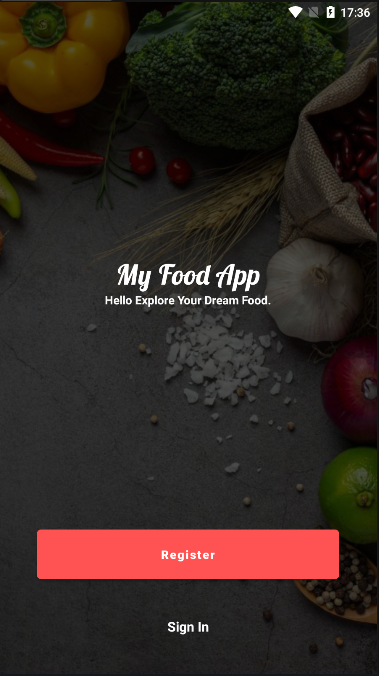

# My Food App

## Description
The food ordering application is a mobile application developed with Kotlin that allows users to easily search and order food right on the application without having to go to the restaurant. In addition, the application also provides management functions for store managers. Restaurant managers can collect revenue statistics, manage products and users, update dish information, and process orders. This application provides a user-friendly interface and useful features for small store-to-customer purchases.

## Features

### Customer
- **Log In and Registration**: Log in and register your account to easily update dishes.
- **Search and View Dishes**: Search and view detailed information about the restaurant's available dishes.
- **Add to Cart**: Add products to your cart.
- **View and Edit Cart**: View your cart and edit the quantity of products.
- **Check Orders**: Check orders and provide delivery information.
- **View Order History**: View the history of past orders.
- **Update Personal Information**: Update your personal information, including your name, email, and password.

### Manager
**Dashboard**: Access a comprehensive dashboard that provides an overview of the app, including sales, orders, item statistics, and user statistics.
- **Manage dishes**: Add, edit or delete dishes available in the restaurant. Update photos, prices and detailed information of the dish
- **User management**: Administrators can manage user accounts, including adding new users, resetting passwords, or deactivating accounts if needed.
- **Manage orders**: View and process incoming orders, track order status, and update customers on their order progress.
- **Manage reviews**: View and approve customer reviews. Hide vulgar values to avoid affecting the user experience.

## Technology Used

- :rocket: Kotlin - The primary programming language.
- :toolbox: Android Jetpack - A set of tools to support Android development.
- :fire: Firebase - Used Firebase for user management, data storage, and user authentication.

## Screenshots

| Screenshot 1                | Screenshot 2                | Screenshot 3                | Screenshot 4                |
| ----------------------------| ----------------------------| ----------------------------| ----------------------------|
|  |  |  |  |

| Screenshot 5                | Screenshot 6                | Screenshot 7                | Screenshot 8               |
| ----------------------------| ----------------------------| ----------------------------| ----------------------------|
|  |  |  |  |

## End

Thank you for exploring our Food Order App! I hope you find it helpful and enjoyable. If you have any questions, encounter issues, or want to contribute to the project, please feel free to reach out to us.

- [Van Chuong](mailto:lvchuong.work@gmail.com) - Author and Developer
- [My GitHub Repository](https://github.com/van-chuong?tab=repositories) - Find the project on my GitHub.

I appreciate your interest and support in making this app better.

